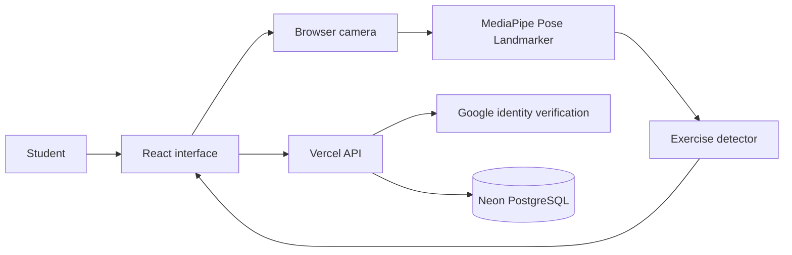
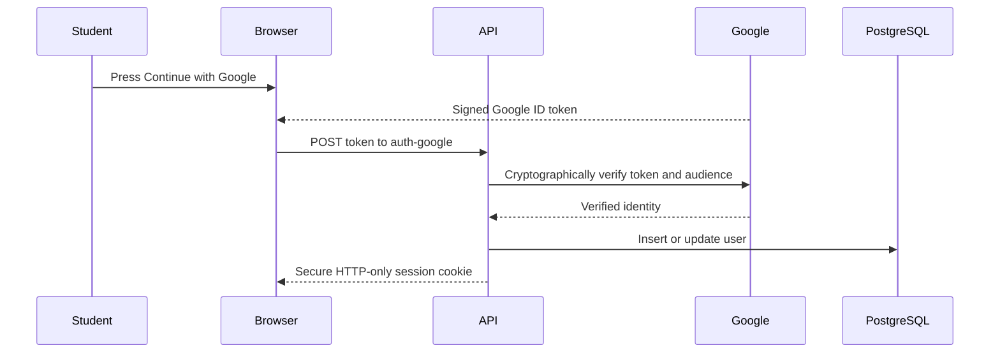
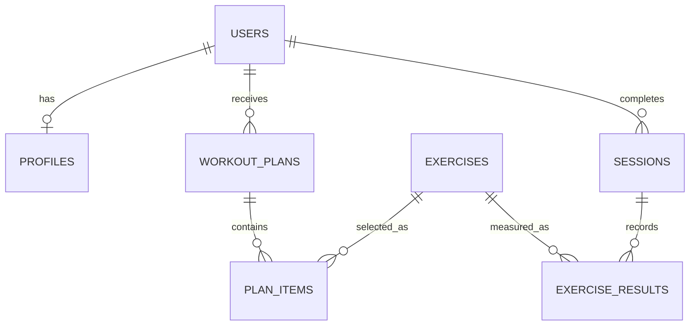

# BITS in Motion — Low-Level Design

This document explains how the application works internally in straightforward terms. It is written so a team member can explain the system during an SIH presentation without needing to know every line of code.

## 1. The simple explanation

BITS in Motion has three main parts:

1. **The React application** draws the screens and receives the camera feed.
2. **MediaPipe in the browser** converts each camera frame into body landmark coordinates. It does not upload or record the image.
3. **The API and PostgreSQL database** keep separate profiles and numerical workout results for signed-in users.



The camera path and account path are intentionally separate. Camera images stay in the browser. The server receives only results such as `12 repetitions`, `4 minutes`, and `2 framing reminders`.

## 2. Frontend application

`src/App.jsx` is the coordinator. It decides which screen is visible and holds the current profile, plan, active exercise, session result, account and session history.

The normal flow is:

```text
Welcome
  → Profile
  → Personalized plan
  → Selected camera coach
  → Result and workout impact
  → Progress or leaderboard
```

There is no large routing framework. The prototype uses a small `screen` state because the presentation flow is linear and this reduces moving parts.

### Important frontend folders

| Folder | Responsibility |
|---|---|
| `src/screens` | Complete screens such as Profile, Coach and Leaderboard |
| `src/components` | Reusable navigation, user menu, cards and Google button |
| `src/data` | Guest-mode exercise catalogue |
| `src/services` | Calls to the `/api` backend |
| `src/utils` | Recommendations, BMI, calories, storage and impact summary |
| `src/vision` | Camera, pose measurements and rep-count state machines |

## 3. Google sign-in flow

The project uses Google Identity Services in the browser and `google-auth-library` on the server.



The application never sees or stores the user's Google password. The server stores Google's stable account identifier, email, display name and avatar URL.

The signed session is held in an HTTP-only cookie. JavaScript cannot read that cookie, which reduces the risk of session theft through an accidental frontend script injection.

## 4. Guest mode versus account mode

### Guest mode

- Profile and sessions use browser `localStorage`.
- Data remains on that browser only.
- The judge demo works without any cloud configuration.
- Sample history is visibly labelled.

### Signed-in mode

- Profile and sessions use the authenticated API.
- The same account can restore progress on another device.
- Sessions save automatically when the coach ends.
- The user may opt in to the public leaderboard using an alias.


Guest mode remains available through an explicit **Continue as Guest** choice if Google, the database or the internet is unavailable. Once a Google account is authenticated, profile, plan and progress requests never fall back to guest `localStorage`. A failed account request produces a visible sync/retry state instead.

Judge Demo can start only while signed out. Its profile and labelled sample history remain in memory only and are discarded when the demo is left or the page reloads.
## 5. API design

The Vite development server and Vercel production function both use `server/handler.js`. Requests use `/api?action=...` so the same handler works locally and after deployment.

| Action | Method | Authentication | What it does |
|---|---|---|---|
| `status` | GET | No | Reports whether Google and database configuration exists |
| `auth-google` | POST | Google token | Verifies Google identity and starts a session |
| `me` | GET | Yes | Returns the signed-in user and profile |
| `logout` | POST | No | Clears the session cookie |
| `profile` | GET/PUT | Yes | Loads or saves the user's profile |
| `plan` | GET/POST | Yes | Restores the latest plan or builds and stores a new one |
| `sessions` | GET/POST | Yes | Loads history or saves a completed session |
| `leaderboard` | GET | Yes | Returns opt-in weekly or all-time totals |

Every protected request obtains the user ID from the signed cookie. The client is never allowed to select a different user ID; browser-supplied ownership fields are ignored. Authenticated mutations also require a same-origin request marker and reject cross-site browser requests.

Request bodies, methods, value ranges, dates and exercise IDs are validated. Session writes include a user-scoped client UUID so a network retry cannot silently create duplicate history. Database setup is run explicitly with `npm run db:setup`, not during each serverless request.
## 6. Database design



### Tables

**`users`**

- Google identity and account display information
- Leaderboard opt-in flag and alias
- Login timestamps

**`profiles`**

- Age, height and weight
- Fitness level and goal
- Available time, location and equipment
- Low-impact preference

**`exercises`**

- Exercise instructions and category
- Camera detector type
- MET value for calorie estimates
- Primary and supporting muscle groups
- Equipment and goal tags

**`workout_plans` and `plan_items`**

- Store why a plan was generated
- Preserve exercise order and targets

**`sessions` and `exercise_results`**

- Duration, estimated calories and session summary
- User-scoped client session UUID for idempotent retries
- Exercise, repetitions, framing interruptions and cue counts
- No raw image or video columns exist

## 7. Personalized recommendation

The recommendation engine is deterministic and explainable:

1. Read level, goal, time, location, equipment and low-impact preference.
2. Load active exercise definitions from SQL for signed-in users.
3. Begin with warm-up and finish with cooldown.
4. Select compatible strength, core and conditioning movements.
5. Add a longer-session movement for eligible 30-minute intermediate plans.
6. Return the plan plus human-readable reasons.

This is more defensible than claiming a black-box AI recommendation. Judges can see exactly why the plan was selected.

## 8. Camera processing pipeline

For every new video frame:

```text
Video frame
  → MediaPipe detects 33 body landmarks
  → choose required visible landmarks
  → calculate angles or normalized distances
  → classify current position
  → debounce across stable frames and time
  → update state machine
  → count only a complete cycle
  → display a held coaching cue
```

The application checks `video.currentTime` so it processes each frame only once. The canvas always uses the video's actual dimensions, and both layers use the same mirror transform.

When the screen closes, the animation frame is cancelled, every media track is stopped, and the MediaPipe model is closed.

## 9. Exercise detectors

All detectors expose the same output:

```js
{
  reps,
  phase,
  phaseLabel,
  measurement,
  feedback
}
```

### Squat

- Landmarks: hip, knee and ankle on the clearest side
- Measurement: knee angle
- Cycle: standing → down → standing
- Default thresholds: standing at least 160°, down at most 110°

### Push-up

- Landmarks: shoulder, elbow, wrist, hip and ankle on the clearest side
- Measurements: elbow angle and shoulder–hip–ankle body angle
- Cycle: straight arms → bottom → straight arms
- Basic cue if the visible torso line falls outside the configured range

### Crunch

- Landmarks: shoulder, hip and knee on the clearest side
- Measurement: shoulder–hip–knee torso angle
- Cycle: extended → curled → extended
- This is deliberately conservative because floor exercises are harder for a single RGB camera

### Jumping jack

- Landmarks: both shoulders, wrists, hips and ankles
- Measurements: ankle distance relative to shoulder width and whether wrists are overhead
- Cycle: closed → open → closed

Each detector rejects insufficient visibility, requires multiple stable frames, and enforces a minimum time between repetitions.

## 10. Result and body-impact summary

The result screen reports only what the system can reasonably infer:

- exercise and repetitions;
- duration;
- estimated calories from MET × weight × hours;
- muscle groups normally involved in the selected exercise;
- visible movement consistency and frequent coaching cues.

It does not claim to measure heart rate, fat loss, internal muscle activation, injury risk or medical improvement.

## 11. Leaderboard calculation

The leaderboard is calculated from completed sessions rather than trusting a total sent by the browser.

For each opted-in user, SQL calculates:

- number of completed workouts;
- sum of tracked repetitions;
- distinct active days.

Ranking order is workouts, then repetitions, then active days. Only the chosen alias and totals are returned. Email, age, weight, BMI and goals are excluded.

## 12. Security and privacy decisions

- Raw frames stay in the browser and are discarded immediately.
- Google tokens are verified on the server against the configured client ID.
- Session cookies are HTTP-only, `SameSite=Lax`, and secure in production.
- SQL uses parameterized queries.
- Every saved row is scoped to the authenticated server-side user ID.
- Credentials live in local/Vercel environment variables and are gitignored.
- Leaderboard participation is off by default.

## 13. Known technical limits

- A single camera provides 2D estimates, not clinical biomechanics.
- Loose clothing, occlusion, poor lighting and camera angle can reduce accuracy.
- Crunch detection needs especially careful side placement.
- The leaderboard is motivational and does not provide anti-cheat guarantees.
- Real Google login and cross-device persistence require the deployment environment variables described in `.env.example`.

## 14. One-minute presentation explanation

> The browser camera is processed locally by MediaPipe, which converts each frame into 33 landmark coordinates. We select the landmarks needed for the chosen exercise, calculate an angle or distance, and pass that measurement through a debounced state machine. A repetition counts only after a complete stable movement cycle. Raw video is never uploaded. If the student signs in with Google, our server verifies the Google token, creates a secure session, and stores only the profile and numerical workout results in PostgreSQL. Those results power cross-device progress and an opt-in privacy-safe leaderboard.
